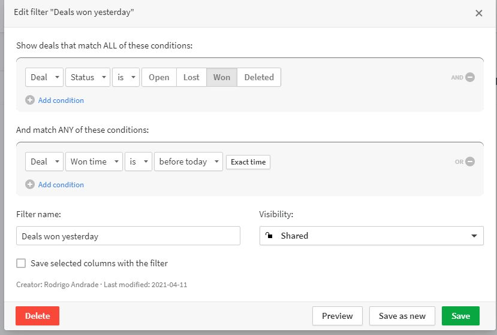
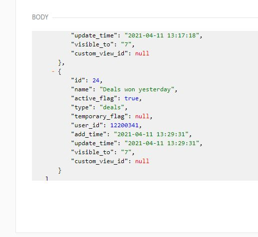

## How to run this project
#### Requirements
1 - We'll need to create a custom filter inside pipedrive with the following configuration:



- Now, with this custom filter created, we'll need to get the filter's id.
    - Got to https://developers.pipedrive.com/docs/api/v1/#!/Filters/getFilters with your `API_KEY`, and run the endpoint selecting the type `deals`.

you will see something like this:


with your custom filter id at hand, you will need to set him at your `.env` config file.

Now, our CronJob for getting deals with status `won` will only bring `today -1day` (yesterday).


### Create a `.env` file in your root directory:

```
DB_HOST=URL_MONGODB_OR_MONGODB_IP
PORT=3000
BLING_API_KEY=YOUR_BLING_API_KEY
BLING_BASE_URL=https://bling.com.br/Api/v2
PIPEDRIVE_BASE_URL=https://{{YOUR_COMPANY_URL}}-sandbox.pipedrive.com
PIPEDRIVE_API_KEY=YOUR_PIPEDRIVE_API_KEY
PIPEDRIVE_PAGINATION_LIMIT=5
PIPEDRIVE_CUSTOM_FILTER_ID=YOUR_CUSTOM_FILTER_ID
```

## Calling endpoint with reports:
[GET] `http://localhost:3000/v1/bling/orders/report`

this endpoint accepts the following filters:

- date (`default: the last 10 items from collection. Note: the order filter will impact in this results`)
- offset (`default: 0`)
- order (`default: -date`)

Example of request:

[GET] `http://localhost:3000/v1/bling/orders/report?offset=0&order=-date`

---

## GitHub Configuration

This project use two 
- **Main branch**: `main`
    - Production type env
- **Sandbox branch**: `sandbox`
    - Sandbox env for testing before deploying to the main branch
- **Dev branch**: `dev`
    - Latest development branch. 

Flow of deployment:
- Updating the `dev` branch:
    `feature/my-new-feature` -> `dev`

- Updating the `sandbox` branch:
    `dev` -> `sandbox`

- Updating the `main` branch:
`dev` -> `main`


---

# Teste Técnico - Back-end (Rodrigo Andrade)
## General instructions
Leia atentamente as instruções abaixo para a realização do teste proposto.

Você terá em torno de 72h para realizar o teste proposto.

---


### OBJETIVO

Deverá construir uma API RESTful usando a tecnologia NodeJS.


---


### REQUISITOS

● Criar contas testes nas plataformas Pipedrive e Bling.

● Criar uma integração entre as plataformas Pipedrive e Bling. (A integração deve buscar as oportunidades com status igual a ganho no Pipedrive, depois inseri-las como pedido no Bling).

● Criar banco de dados mongo, existem serviços como MongoDB Atlas para criar de graça

● Criar uma collection no banco de dados MongoDB agregando as oportunidades inseridas no Bling por dia e valor total.

● Criar endpoint para trazer os dados consolidados da collection do MongoDB.

---

## INSTRUÇÕES

● Desenvolva e versione o projeto usando git

● Utilize o GitHub para hospedar o código

● Enviar o link do repositório para people@linkapi.com.br

---

## O QUE SERÁ AVALIADO

● Quantidade de requisitos realizados

● Desacoplamento de código

● Legibilidade

● Boas práticas de desenvolvimento de API RESTful

● Performance